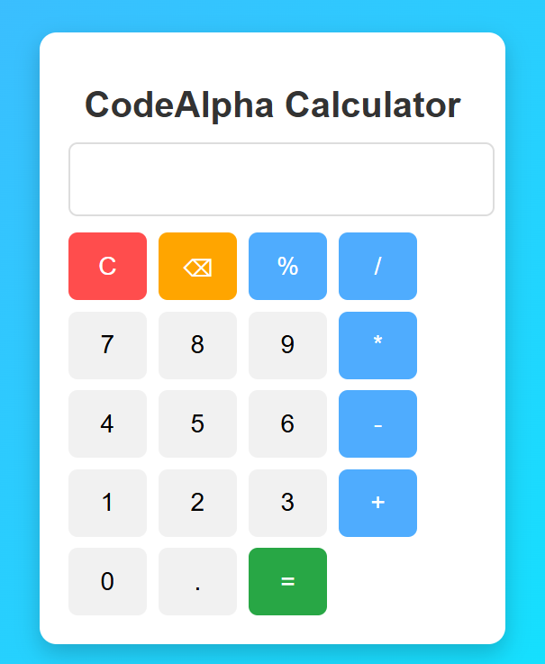

# 🧮 Calculator Web Application

A simple and responsive calculator built using **HTML**, **CSS**, and **JavaScript**.

## 📌 Features

- Basic Arithmetic Operations
  - Addition (+)
  - Subtraction (-)
  - Multiplication (×)
  - Division (÷)

- Responsive Design
- Clean User Interface
- Keyboard Friendly
- Error Handling

## 🛠️ Technologies Used

- HTML5
- CSS3
- JavaScript

## 📂 Project Structure

```
codeAlpha_calculator/
│── index.html
│── style.css
│── script.js
│── calculator.png
```

## 🚀 How to Run

1. Download or Clone the repository

```bash
git clone https://github.com/renukumar5659/codeAlpha_calculator.git
```

2. Open the project folder.

3. Double-click `index.html`

or

Open with **VS Code** and run using **Live Server**.

## 📸 Screenshot



## 🌐 Live Demo

Coming Soon...

## 👨‍💻 Author

**Boyapalli Renu Kumar**

- GitHub: https://github.com/renukumar5659
- LinkedIn: https://www.linkedin.com/in/renu-kumar-boyapalli-a2194529a/

## 📄 License

This project is for educational purposes.

⭐ If you like this project, don't forget to star the repository.
